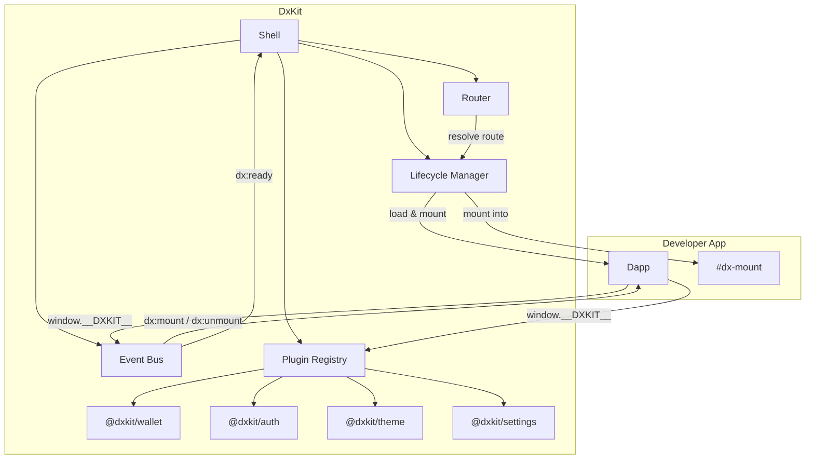

# DNZN // DxKit

A headless microframework for building composable dapps. Routing, lifecycle management, event bus, plugin registry — zero DOM ownership.

by **Denizen.** // dnzn.wei

## Release Info

### Project Status

| STATUS | VERSION | AUDIT |
|:---|:---|:---|
| `vibe/alpha` | 0.1.0 | [Self Review](audit/self/dxkit-0.1.0.md) |

This is alpha software. Let it bake. Do not trust in production without thorough testing and review. 

No warranty.

### Installation

*Framework*

```
npm install dxkit
```

*Plugins*

```
npm install @dxkit/audit
npm install @dxkit/wallet
npm install @dxkit/settings
npm install @dxkit/theme
```

## Architecture

The shell owns orchestration. The developer owns the DOM. Dapps are self-contained scripts that mount into a provided `#dx-mount` container and interact with plugins and events through the shared `__DXKIT__` context.



## Documentation

### Framework

| DOCUMENT | DESCRIPTION |
|----------|-------------|
| [Getting Started](docs/getting-started.md) | Framework overview, core concepts, lifecycle, config, full sample project |
| [Dapp Development](docs/dapp-development.md) | Manifest, lifecycle events, context, settings, sub-routing, standalone mode |
| [Plugin Development](docs/plugin-development.md) | Plugin interface, init lifecycle, custom events, duck-typing, full example |
| [System Internals](docs/system-internals.md) | Architecture, sequence diagrams, router/lifecycle/event bus internals |
| [Events Reference](docs/events-reference.md) | Complete event catalog with payloads, organized by source |
| [API Reference](docs/api-reference.md) | All factory functions, interfaces, and type definitions |
| [Cookbook](docs/cookbook.md) | Patterns & recipes — DxKit by example |

### Plugins

| DOCUMENT | DESCRIPTION |
|----------|-------------|
| [@dxkit/wallet](docs/plugins/wallet.md) | Wallet providers, EIP-1193, local dev, custom providers |
| [@dxkit/auth](docs/plugins/auth.md) | Passthrough auth, wallet bridging |
| [@dxkit/theme](docs/plugins/theme.md) | CSS theming, light/dark/system, DOM integration |
| [@dxkit/settings](docs/plugins/settings.md) | Key-value store, sections, form generation, dapp toggles |


## Development

### Common Helpers

```bash
make setup          # Install dependencies and initialize development environment
make build          # Build dxkit + all plugins -> dist/ + plugins/*/dist/
make test           # Lint + run all tests (vitest + happy-dom)
make test-watch     # Lint + run tests in watch mode
make lint           # Run biome check
make lint-fix       # Run biome check with auto-fix
make lint-format    # Run biome format with auto-fix
make clean          # Remove all dist/ directories
make superclean     # Remove all dist/ and node_modules/ directories
make audit          # Run pnpm audit, semgrep SAST, and gitleaks secret detection
```

Tests run the standalone vitest config (`vitest.config.ts`) with happy-dom for DOM APIs.

### Build System

Each package (core + plugins) uses `tsup` to produce three output formats from a single TypeScript entry point:

| FORMAT | PATH | PURPOSE |
|--------|------|---------|
| ESM | `dist/index.js` | Modern `import`/`export` — bundlers, Node.js, `<script type="module">` |
| CJS | `dist/index.cjs` | CommonJS `require()` — legacy Node.js tooling |
| IIFE | `dist/index.global.js` | Self-contained `<script>` tag — no bundler required, good for IPFS/etc |

The `exports` field in each `package.json` maps consumers to the right format automatically. IIFE builds attach to a global (`DxKit`, `DxWallet`, `DxAuth`, `DxTheme`, `DxSettings`) for use in static HTML without a build step — the primary deployment target for dapps served from IPFS or `file:///`.

Plugin IIFE builds bundle dxkit core inline (`noExternal: ['dxkit']`). ESM/CJS builds declare it as `external` to avoid duplication when used with a bundler.

## License

MIT — see [LICENSE](LICENSE).
