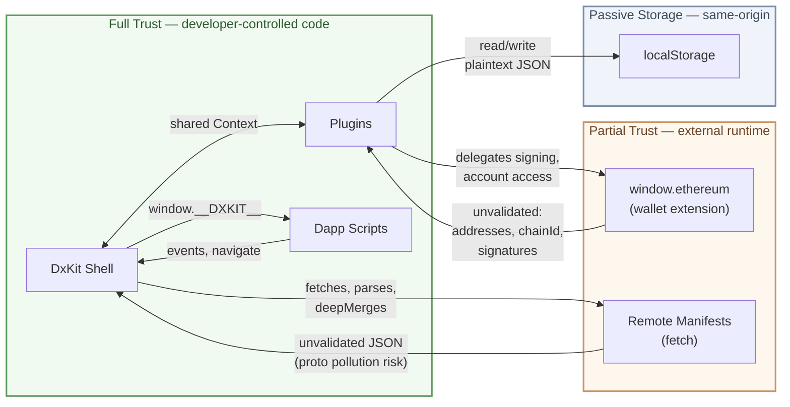
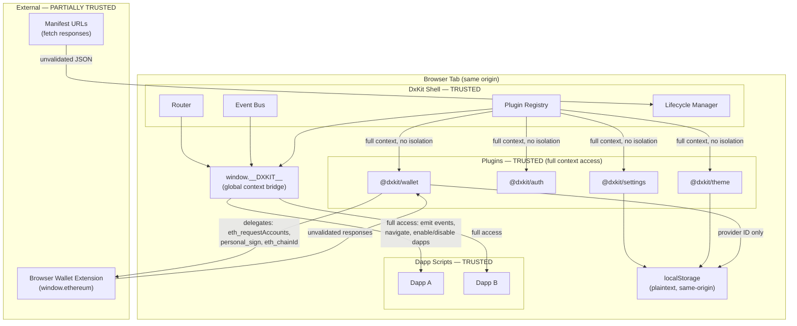

# DxKit Software Review & Security Audit

| Field | Value |
|:---|:---|
| Project | DxKit |
| Version | v2026.03.29.000001 |
| Date | 2026.03.29 |
| Auditor | Self-review by project developers |
| AI Model | Claude Opus 4.6 (1M context) |
| Scope | Core framework + all bundled plugins |

## Disclosure

**This is a self-review** performed by the project developers with assistance from Claude Opus 4.6 (1M context) on 2026.03.29. It is not an independent third-party security audit. Findings reflect the best effort of the authors reviewing their own work. Users should evaluate the code independently before trusting it in production.

## Executive Summary

DxKit is a headless microframework for composable dapp development, providing routing, lifecycle management, an event bus, and a plugin registry with zero DOM ownership. The framework ships with four plugins: wallet, auth, theme, and settings.

The codebase demonstrates strong architectural discipline. It has **zero npm production dependencies** across all packages, which eliminates the traditional package supply chain risk. However, the wallet plugin has a significant **runtime supply chain dependency** on `window.ethereum` — an externally injected provider from browser wallet extensions (MetaMask, Brave, etc.) that the plugin trusts and delegates to without response validation. TypeScript strict mode is enforced, the Biome linter reports zero violations, and all 214 tests pass. The code is clean of injection vectors — no eval(), innerHTML, document.write(), or dynamic code execution patterns were found.

The primary findings are architectural in nature rather than exploitable vulnerabilities. The framework operates on a **trusted-code trust model** where all dapps and plugins run in the same execution context with full access to the shared global. This is intentional and appropriate for the target use case (developer-controlled dapp shells), but must be clearly understood by consumers. The most actionable code-level finding is a prototype pollution vector in the `deepMerge` utility that processes manifest overrides from fetch responses.

**Finding Summary**: 0 Critical, 1 High, 5 Medium, 2 Low, 4 Info.

## Dependency Audit

### Production Dependencies

| Package | Production Deps |
|:---|:---|
| dxkit (core) | **0** |
| @dxkit/wallet | 0 (workspace only) |
| @dxkit/auth | 0 (workspace only) |
| @dxkit/theme | 0 (workspace only) |
| @dxkit/settings | 0 (workspace only) |

All inter-package dependencies are workspace references (`workspace:*`), resolved at build time. No external npm code ships in production bundles.

### pnpm audit --prod

```
No known vulnerabilities found
```

### Supply Chain Assessment

**npm Risk: Minimal.** Zero npm production dependencies means no package supply chain attack surface. The only bundled code is what the project authors wrote. Development dependencies (vitest, tsup, biome, typescript) affect the build environment but do not ship in production artifacts.

**Runtime Risk: Moderate.** The wallet plugin depends on `window.ethereum`, an externally injected provider from browser wallet extensions. This is third-party code that:
- Is not auditable at build time (injected at runtime by the user's browser extension)
- Receives delegated calls for account access (`eth_requestAccounts`), chain identification (`eth_chainId`), and message signing (`personal_sign`)
- Returns values that the plugin trusts without validation (see [S-08])
- Has full access to the same execution context as the dapp

This is an inherent and industry-standard trust assumption for any Ethereum dapp, but it represents a real supply chain surface. A compromised wallet extension could return forged addresses/chain IDs or intercept signing requests. This risk is borne by the end user's choice of wallet software, not by DxKit's dependency decisions.

## Static Analysis

### Biome Linter

```
Checked 29 files in 34ms. No fixes applied.
```

Zero violations. All source and test files pass the configured ruleset. Notable: `noExplicitAny` and `noNonNullAssertion` are disabled — the codebase uses `any` casts in places where TypeScript's type system cannot express the intended contract (plugin duck-typing, generic registry retrieval). These are reviewed individually in the findings below.

### Test Suite

```
Test Files  10 passed (10)
      Tests  214 passed (214)
   Duration  870ms
```

All tests pass. Test execution is fast (<1s), indicating no flaky or timing-dependent tests.

## Architecture & Trust Model

### Trust Model

DxKit operates on a **same-origin trusted code** model.

**Trust Boundaries:**

1. **Shell ↔ Plugins**: Full trust. Plugins receive the complete Context object and can mutate it (e.g., settings plugin injects `context.settings`). No isolation.
2. **Shell ↔ Dapps**: Full trust. Dapps access `window.__DXKIT__` which exposes the event bus, plugin registry, router, and dapp management APIs.
3. **Shell ↔ Browser Wallet**: Partial trust. The wallet plugin interacts with `window.ethereum`, an externally injected provider. Responses are not validated beyond basic type expectations.
4. **Shell ↔ Network**: Partial trust. Manifest URLs are fetched and parsed as JSON without schema validation. localStorage data is parsed with try-catch fallbacks.

**Trust Boundary View**



**Component Relationship View**



**Assessment**: The trust model is appropriate for the stated use case (developer-controlled dapp shells). The framework does not attempt to sandbox untrusted code, and this is the correct design choice. However, the trust assumptions should be more explicitly documented for consumers.

## Security Findings

#### [S-01] Prototype Pollution in deepMerge

| Field | Value |
|:---|:---|
| Severity | HIGH |
| Category | Input Validation |
| Location | `src/utils.ts:5` |
| Status | Mitigated |

**Description**: The `deepMerge` function recursively merges object properties. Without a guard, `__proto__`, `constructor`, or `prototype` keys in untrusted input (e.g., fetched manifest overrides via `shell.ts:147`) could pollute `Object.prototype`.

**Impact**: If a malicious manifest is fetched via `dappEntries[].manifest`, the overrides could pollute the Object prototype, affecting all objects in the application. Example payload: `{"overrides": {"__proto__": {"isAdmin": true}}}`.

**Mitigating factors**: Manifest URLs are provided by the shell developer in configuration, not by end users. Exploitation requires control over a manifest endpoint.

**Resolution**: Key guard added at `src/utils.ts:5` — `__proto__`, `constructor`, and `prototype` keys are silently skipped during merge. Four test cases added in `tests/utils.test.ts` covering each dangerous key and nested merge paths. All 212 tests pass.

---

#### [S-02] Global Context Exposure via window.__DXKIT__

| Field | Value |
|:---|:---|
| Severity | MEDIUM |
| Category | Trust Model |
| Location | `src/shell.ts:209-210` |
| Status | Mitigated |

**Description**: The shell exposes the full Context object on `window.__DXKIT__`, providing any JavaScript on the page with access to the event bus (emit arbitrary events), plugin registry (access all plugins), router (navigate anywhere), and dapp management (enable/disable dapps).

**Impact**: Any third-party script, browser extension, or injected code on the same origin can interact with the shell as if it were a trusted dapp. This includes emitting fake wallet connection events, disabling dapps, or navigating to arbitrary routes.

**Mitigating factors**: This is by design — the framework's architecture requires a global bridge for dapp scripts loaded as ES modules. The developer controls which scripts run on their page.

**Resolution**: `Object.freeze(context)` applied at `src/shell.ts:209` before assigning to `window.__DXKIT__`. This prevents mutation of the context bridge (e.g., replacing `router.navigate` or `events.emit` with malicious functions) while still allowing normal method calls. The freeze is shallow — plugins manage their own mutable state internally. The trust model should still be documented in the Getting Started guide.

---

#### [S-03] Plugin Init Errors Not Caught

| Field | Value |
|:---|:---|
| Severity | MEDIUM |
| Category | Error Handling |
| Location | `src/shell.ts:191-201` |
| Status | Mitigated |

**Description**: During `shell.init()`, plugin initialization is sequential with `await plugin.init(context)`. Without error containment, a single plugin throwing during init would crash the entire shell initialization, leaving it in a partially initialized state.

**Impact**: A buggy plugin would prevent all dapps from loading with no recovery path.

**Resolution**: Plugin init is now wrapped in try-catch. Failures emit `dx:error` with `source: 'plugin:<name>'` and continue initializing remaining plugins. Test added in `tests/shell.test.ts` verifying that a throwing plugin is contained while subsequent plugins and the shell complete initialization normally.

---

#### [S-04] No Manifest Schema Validation

| Field | Value |
|:---|:---|
| Severity | MEDIUM |
| Category | Input Validation |
| Location | `src/shell.ts:141-151` |
| Status | Mitigated |

**Description**: Manifests fetched via `loadDappManifest()` were parsed with `res.json()` and used directly without validating their structure. Missing required fields would cause confusing downstream errors.

**Resolution**: Added `isValidManifest()` shape check at `src/shell.ts:142` that verifies `id`, `route`, `entry` (all strings) and `nav.label` (string) exist before accepting a fetched manifest. Invalid manifests are rejected with a `dx:error` event identifying the source URL and the missing fields. Test added in `tests/shell.test.ts` verifying rejection and error emission.

---

#### [S-05] Settings Plugin Duck-Typing Without Validation

| Field | Value |
|:---|:---|
| Severity | MEDIUM |
| Category | Trust Model |
| Location | `src/shell.ts:59-62` |
| Status | Accepted Risk |

**Description**: The shell detects the settings plugin by checking `'getSettingsAPI' in settingsPlugin`, then casts the result to `Settings` without validating the returned object's shape. A plugin registered under the name 'settings' that happens to have a `getSettingsAPI` property could return an object that doesn't implement the Settings interface.

**Impact**: If a non-conforming plugin is registered as 'settings', the shell would call methods that don't exist, producing runtime errors during `initEnabledState()`.

**Mitigating factors**: Plugin registration is developer-controlled. This would only occur if a developer registers a non-settings plugin under the name 'settings'.

**Recommendation**: Accept as low risk given the trust model. Optionally, validate that the returned object has `get` and `set` methods before using it.

---

#### [S-06] localStorage Stores Data in Plaintext

| Field | Value |
|:---|:---|
| Severity | LOW |
| Category | Data Storage |
| Location | `plugins/settings/src/index.ts:53`, `plugins/theme/src/index.ts:67-68`, `plugins/wallet/src/index.ts:169` |
| Status | Mitigated |

**Description**: All three plugins that persist state (settings, theme, wallet) store data in localStorage as plaintext JSON. The settings plugin stores arbitrary key-value pairs, the theme plugin stores mode/theme selection, and the wallet plugin stores the active provider ID.

**Impact**: Any same-origin script can read and modify persisted state. For the current plugin set, this is limited to UI preferences and a provider identifier (not keys or credentials). However, if a developer stores sensitive data via the settings API, it would be readable.

**Resolution**: Security note added to `docs/plugins/settings.md` (Persistence section) explicitly warning that settings are plaintext and must not be used for secrets, API keys, tokens, or sensitive data.

---

#### [S-07] No Event Emission Rate Limiting

| Field | Value |
|:---|:---|
| Severity | LOW |
| Category | Denial of Service |
| Location | `src/events.ts:28-29` |
| Status | Accepted Risk |

**Description**: The event bus has no rate limiting or backpressure mechanism. Any code with access to `window.__DXKIT__.events.emit()` can emit events at arbitrary frequency.

**Impact**: A runaway loop or malicious script could flood the event bus, causing performance degradation. Since handlers execute synchronously, a high-frequency emitter would block the main thread.

**Mitigating factors**: Only trusted code has access to the event bus. The browser's own event loop provides natural backpressure.

**Recommendation**: Accept as low risk. If needed in the future, consider adding a configurable rate limit or warning when emission frequency exceeds a threshold.

---

#### [S-08] Wallet Plugin Trusts window.ethereum as Unvalidated Runtime Dependency

| Field | Value |
|:---|:---|
| Severity | MEDIUM |
| Category | Supply Chain / Trust Boundary |
| Location | `plugins/wallet/src/index.ts:23-25,41-48,78-81` |
| Status | Accepted Risk |

**Description**: The EIP-1193 provider treats `window.ethereum` as a trusted runtime dependency. It delegates account access (`eth_requestAccounts`), chain identification (`eth_chainId`), and message signing (`personal_sign`) to this externally injected provider without validating responses. The provider is injected by browser wallet extensions (MetaMask, Brave, etc.) — third-party code that is not auditable at build time and runs in the same execution context as the dapp.

**Impact**: A compromised or malicious wallet extension could:
- Return forged account addresses or chain IDs, confusing dapp logic
- Intercept or alter signing requests
- Silently refuse to execute `wallet_revokePermissions` (already handled via catch)

While this is a standard pattern across the Ethereum ecosystem, it represents a real runtime supply chain surface. Unlike npm dependencies which can be pinned and audited, the wallet provider is chosen by the end user and can change between sessions.

**Mitigating factors**: This is inherent to the EIP-1193 architecture. Every Ethereum dapp shares this trust assumption. The wallet plugin does handle the `window.ethereum` absence case gracefully (throws descriptive error). The `revokeOnDisconnect` default mitigates silent reconnection.

**Recommendation**: Accept as inherent to the architecture. Consider adding optional response shape validation (e.g., verify `eth_requestAccounts` returns an array of hex strings) as defense-in-depth, without breaking interoperability.

## Code Quality Findings

#### [Q-01] Unsafe `as any` Casts in Plugin Interactions

| Field | Value |
|:---|:---|
| Severity | INFO |
| Category | Type Safety |
| Location | `src/shell.ts:62`, `plugins/wallet/src/index.ts:23-25,37,296`, `plugins/settings/src/index.ts:219` |
| Status | Accepted |

**Description**: Several `as any` casts are used at trust boundaries where TypeScript's type system cannot express the intended contract:
- `shell.ts:62`: Casting settings plugin to access `getSettingsAPI()`
- `wallet/index.ts:23,37,296`: Accessing `window.ethereum` (untyped browser global)
- `settings/index.ts:219`: Injecting `settings` property onto Context

**Assessment**: These casts are appropriate given the constraints. The alternatives (module augmentation for window.ethereum, intersection types for context mutation) would add complexity without improving safety. The casts are localized and documented by surrounding code context.

---

#### [Q-02] Event Handler Memory Accumulation

| Field | Value |
|:---|:---|
| Severity | INFO |
| Category | Memory Management |
| Location | `src/events.ts:40-43` |
| Status | Open |

**Description**: The event bus handler map (`handlers`) grows as events are subscribed to but individual event maps are never deleted even when all handlers for an event are removed. After `off()`, the map entry remains as an empty Map.

**Impact**: Negligible in practice — empty Maps consume minimal memory. Only relevant in a theoretical scenario with thousands of unique event names over a long-lived session.

**Recommendation**: Optionally clean up the event key when its handler map becomes empty:
```typescript
if (map.size === 0) delete handlers[key];
```

---

#### [Q-03] Router Sorts Manifests on Every Resolve

| Field | Value |
|:---|:---|
| Severity | INFO |
| Category | Performance |
| Location | `src/router.ts:40` |
| Status | Open |

**Description**: `resolve()` creates a sorted copy of the manifests array on every call (`[...manifests].sort(...)`). Since manifests don't change after router creation, this sort could be performed once at construction time.

**Impact**: Negligible for typical manifest counts (<50). The sort is O(n log n) per navigation, but n is small.

**Recommendation**: Pre-sort manifests in the router constructor for cleanliness, though the performance impact is immaterial at expected scale.

---

#### [Q-04] Inconsistent Error Wrapping Pattern

| Field | Value |
|:---|:---|
| Severity | INFO |
| Category | Code Consistency |
| Location | `src/lifecycle.ts:99`, `src/lifecycle.ts:111` |
| Status | Open |

**Description**: The lifecycle manager wraps errors with `err instanceof Error ? err : new Error(String(err))` in two places. This pattern is correct but could be extracted to a shared helper if used more widely. Currently it's only in two adjacent catch blocks.

**Assessment**: Not worth abstracting at this scale. Note for future reference if the pattern appears in more locations.

## Test Coverage Assessment

### Overview

| Metric | Value |
|:---|:---|
| Test Files | 10 |
| Total Tests | 214 |
| Pass Rate | 100% |
| Execution Time | 936ms |

### Coverage by Module

| Module | Tests | Assessment |
|:---|:---|:---|
| Event Bus + Registry | 25 | Strong. Covers emission, subscription, pause/resume, namespace validation, conflict detection |
| Lifecycle Manager | 15 | Good. Covers mount/unmount, error paths, plugin requirement validation |
| Plugin Registry | 6 | Adequate. Covers CRUD operations. Missing: duplicate registration, invalid input |
| Router | 10 | Good. Covers resolution, prefix matching, basePath, listeners. Missing: hash mode, query params |
| Shell | 35 | Strong. Covers init, navigation, plugin lifecycle, enable/disable, context exposure, plugin init failure containment, manifest validation |
| Utils (deepMerge) | 15 | Strong. Covers merge semantics, arrays, null handling, prototype pollution guards |
| Auth Plugin | 10 | Good. Covers passthrough flow, wallet sync, state management |
| Settings Plugin | 25 | Strong. Covers CRUD, listeners, events, manifest collection, sections |
| Theme Plugin | 24 | Strong. Covers modes, DOM attributes, persistence, settings sync, corrupted data |
| Wallet Plugin | 49 | Strong. Covers providers, coordinator, persistence, events, multi-provider |

### Notable Coverage Gaps

1. ~~No prototype pollution tests for `deepMerge`~~ — **Resolved**: 4 tests added covering `__proto__`, `constructor`, `prototype`, and nested merge paths
2. **No concurrent operation tests** — rapid mount/unmount, navigation during init, simultaneous plugin init
3. ~~**No plugin init failure tests**~~ — **Resolved**: test added verifying error containment and continued init — what happens when a plugin throws during init()
4. ~~**No malformed manifest tests**~~ — **Resolved**: test added verifying rejection and dx:error emission — JSON that parses but lacks required fields
5. **No hash-mode routing tests** — router tests only cover history mode
6. **No event handler cleanup verification** — tests don't assert that destroy() removes all listeners

### Recommendations

- Add a security-focused test file (`tests/security.test.ts`) covering prototype pollution, namespace injection, and malformed input
- Add error recovery tests for plugin init failures
- Add hash-mode router tests
- Add cleanup/destroy verification tests that check for listener leaks

## Documentation Review

### Accuracy

The documentation is accurate and reflects the current implementation. Code examples match the API surface. Event names, payloads, and factory function signatures are consistent between docs and source.

### Completeness

All public APIs are documented across the 11 documentation files. The API reference covers every factory function, interface, and type definition.

### Identified Gaps

1. **Trust model not documented**: No documentation explicitly states that dapps and plugins are trusted code running in the same execution context. This is the most important gap.
2. **Settings security guidance missing**: No warning that the settings API should not be used for secrets.
3. **Plugin registration order**: The settings plugin must be registered last (after plugins that declare settings), but this is only mentioned in passing — not prominently warned.
4. **Error handling patterns**: No documentation on how dapps should handle errors from the framework or plugins.
5. **Browser support**: No browser compatibility matrix or minimum version requirements.

### Inconsistencies

1. **Script caching language**: `dapp-development.md` says "Scripts are loaded once and cached" while `system-internals.md` describes the Set-based deduplication mechanism. Both are accurate but use different framing.
2. **Deep merge array behavior**: Documented in three places (`api-reference.md`, `cookbook.md`, `system-internals.md`) with slightly different wording. All correct, but could be consolidated.

## Recommendations

### Immediate (Before Production Use)

1. ~~**Fix prototype pollution in deepMerge**~~ [S-01] — **Resolved.** Key guard added at `src/utils.ts:5`, 4 tests added.
2. ~~**Add try-catch around plugin init**~~ [S-03] — **Resolved.** Plugin init errors contained with `dx:error` emission at `src/shell.ts:195-199`.
3. **Document the trust model** — Add a "Security Model" section to Getting Started explaining that all code (dapps, plugins) is trusted and runs in the same context.

### Short-Term (Next Release Cycle)

4. ~~**Add manifest schema validation**~~ [S-04] — **Resolved.** `isValidManifest()` check added at `src/shell.ts:142`.
5. **Add security-focused tests** — Prototype pollution, malformed manifests, namespace injection.
6. **Add plugin init error recovery tests** — Verify the shell remains usable after a plugin fails.
7. ~~**Document settings security**~~ — **Resolved.** Plaintext warning added to `docs/plugins/settings.md`.

### Long-Term (Ongoing)

8. ~~**Consider Object.freeze on context**~~ [S-02] — **Resolved.** `Object.freeze(context)` applied at `src/shell.ts:209`.
9. **Pre-sort router manifests** [Q-03] — Minor performance improvement.
10. **Add hash-mode routing tests** — Cover the alternate routing mode.
11. **Add browser support documentation** — Minimum browser versions, required APIs (ES2022, History API, CustomEvent).

## Appendix

### File Inventory

**Core Source** (7 files):
- `src/index.ts` — Barrel export
- `src/events.ts` — Event bus and registry
- `src/lifecycle.ts` — Dapp mount/unmount management
- `src/registry.ts` — Plugin registry
- `src/router.ts` — Path resolution and navigation
- `src/shell.ts` — Main orchestrator
- `src/utils.ts` — Deep merge utility

**Type Definitions** (6 files):
- `src/types/index.ts` — Barrel export
- `src/types/context.ts` — Context and window augmentation
- `src/types/events.ts` — Event bus types
- `src/types/interfaces.ts` — Plugin, Wallet, Auth, Theme interfaces
- `src/types/manifest.ts` — Dapp manifest types
- `src/types/settings.ts` — Settings types
- `src/types/shell.ts` — Shell config and interface types

**Plugin Source** (4 files):
- `plugins/auth/src/index.ts` — Passthrough auth plugin
- `plugins/settings/src/index.ts` — Settings plugin
- `plugins/theme/src/index.ts` — CSS theme plugin
- `plugins/wallet/src/index.ts` — Wallet coordinator + providers

**Test Files** (10 files):
- `tests/events.test.ts` — 25 tests
- `tests/lifecycle.test.ts` — 15 tests
- `tests/registry.test.ts` — 6 tests
- `tests/router.test.ts` — 10 tests
- `tests/shell.test.ts` — 35 tests
- `tests/utils.test.ts` — 15 tests
- `plugins/auth/tests/auth.test.ts` — 10 tests
- `plugins/settings/tests/settings.test.ts` — 25 tests
- `plugins/theme/tests/theme.test.ts` — 24 tests
- `plugins/wallet/tests/wallet.test.ts` — 49 tests

**Documentation** (11 files):
- `docs/getting-started.md`
- `docs/dapp-development.md`
- `docs/plugin-development.md`
- `docs/system-internals.md`
- `docs/events-reference.md`
- `docs/api-reference.md`
- `docs/cookbook.md`
- `docs/plugins/auth.md`
- `docs/plugins/settings.md`
- `docs/plugins/theme.md`
- `docs/plugins/wallet.md`

### Tool Output

**pnpm audit --prod**:
```
No known vulnerabilities found
```

**Biome check**:
```
Checked 29 files in 34ms. No fixes applied.
```

**Vitest**:
```
Test Files  10 passed (10)
      Tests  214 passed (214)
   Duration  870ms
```
