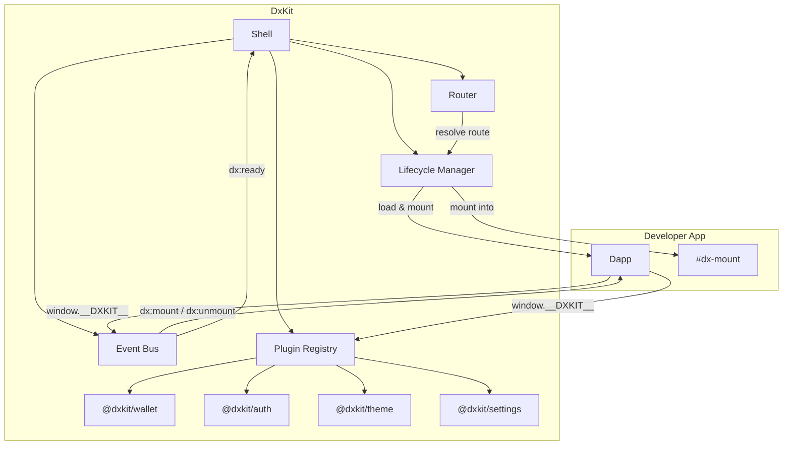

**Getting Started** | [Dapp Development](dapp-development.md) | [Plugin Development](plugin-development.md) | [System Internals](system-internals.md) | [Events Reference](events-reference.md) | [API Reference](api-reference.md) | [Cookbook](cookbook.md)

---

# Getting Started

DxKit is a headless microframework for composable dapp development. It provides routing, lifecycle management, an event bus, and a plugin system. You bring the UI — DxKit brings the orchestration.

[Architecture](#architecture) | [Framework Overview](#framework-overview) | [Core Concepts](#core-concepts) | [System Lifecycle](#system-lifecycle) | [Configuration](#configuration) | [Sample Project](#sample-project)

---

## Architecture

The shell owns orchestration. The developer owns the DOM. Dapps are self-contained scripts that mount into a provided `#dx-mount` container and interact with plugins and events through the shared `__DXKIT__` context.



## Framework Overview

**What it is:**
- A shell that mounts and unmounts self-contained dapps based on routes
- An event-driven plugin system for cross-cutting concerns (wallets, auth, themes, settings)
- Framework-agnostic — dapps can be vanilla JS, React, Svelte, or anything else
- Zero-build capable — ships IIFE bundles that work from a `<script>` tag

**What it isn't:**
- Not a UI library or component framework
- Not a state management layer — no reactive store, or shared data between dapps (integrate your own via Redux, Zustand, Svelte, etc)
- Zero DOM ownership

## Core Concepts

### Shell

The shell is the orchestrator. It manages plugins, loads dapp manifests, sets up routing, and coordinates mount/unmount lifecycle. You create one shell per application.

```js
const shell = DxKit.createShell({
  plugins: { theme: DxTheme.createCSSTheme() },
  manifests: [/* dapp manifests */],
});
await shell.init();
```

### Dapps

A dapp is a self-contained application that mounts into the shell. Each dapp has a manifest (identity, route, entry point) and a JavaScript entry file that listens for `dx:mount` and `dx:unmount` events.

Dapps don't know about each other. They communicate through the event bus.

### Interfaces & Plugins

Plugins extend the shell with capabilities — wallet connectivity, authentication, theming. Each plugin implements the `Plugin` interface: a `name`, an optional `init(context)`, and an optional `destroy()`.

DxKit ships four plugins:

- [`@dxkit/wallet`](plugins/wallet.md)
- [`@dxkit/auth`](plugins/auth.md)
- [`@dxkit/theme`](plugins/theme.md)
- [`@dxkit/settings`](plugins/settings.md)

### Events

All communication flows through a typed event bus. The shell emits lifecycle events (`dx:ready`, `dx:mount`, `dx:unmount`). Plugins emit namespaced events (`dx:plugin:wallet:connected`). Dapps can register and emit their own events.

```text
Shell Events        dx:ready, dx:mount, dx:unmount, dx:route:changed, ...
Plugin Events       dx:plugin:<name>:<action>
Custom Events       <anything without dx: prefix>
```

> **Note:** Dapps listen for `dx:mount`/`dx:unmount` via `window.addEventListener` — not `dx.events.on()` — because the mount handler must be registered before `window.__DXKIT__` is available. Use `dx.events.on()` for everything else once inside the mount handler. See [Dapp Development > Lifecycle Events](dapp-development.md#lifecycle-events) for details.

## System Lifecycle

### Init

When you call `shell.init()`, the following happens in order:

1. **Register plugins** — all plugins added to the registry, `dx:plugin:registered` emitted for each
2. **Load manifests** — fetched or read from config (see [Configuration](#manifest-loading))
3. **Initialize plugins** — each plugin's `init(context)` called in config order
4. **Setup enabled state** — optional dapps get their enabled/disabled state from manifest defaults + persisted settings
5. **Create router** — only enabled manifests are routable
6. **Expose context** — `window.__DXKIT__` set for dapp access
7. **Resolve initial route** — if the current URL matches a dapp, mount it
8. **Emit `dx:ready`**

### Navigation

When the user navigates (or you call `shell.navigate(path)`):

1. Router resolves the path to a manifest (longest prefix match)
2. Current dapp unmounts — `dx:unmount` emitted, then `dx:dapp:unmounted`
3. New dapp's styles load (non-blocking — CSS errors don't block mount)
4. New dapp's script loads (blocking — script errors prevent mount)
5. `dx:mount` emitted with `{ id, container, path }`
6. `dx:dapp:mounted` emitted
7. `dx:route:changed` emitted

### Teardown

`shell.destroy()` unmounts the current dapp, destroys all plugins, removes the `window.__DXKIT__` context, and cleans up event listeners.

## Configuration

### ShellConfig

```js
DxKit.createShell({
  // Plugin instances, keyed by name
  plugins: {
    theme: DxTheme.createCSSTheme(),
    wallet: DxWallet.createWallet({ providers: [DxWallet.createLocalWalletProvider()] }),
    settings: DxSettings.createSettings(),
  },

  // Dapp manifests — pick one of three loading strategies:
  manifests: [/* inline manifests */],          // Option 1: inline
  dapps: [{ manifest: '/app/manifest.json' }],  // Option 2: fetch
  registryUrl: '/registry.json',                // Option 3: registry (default)

  // Routing
  basePath: '/',           // prefix for all routes (default: '/')
  mode: 'history',         // 'history' or 'hash' (default: 'history')

  // Advanced — override default <script>/<link> injection
  scriptLoader: (src) => { /* custom */ },
  styleLoader: (href) => { /* custom */ },
})
```

### DappManifest

Every dapp declares its identity, routing, and capabilities in a manifest:

```js
{
  id: 'dashboard',               // unique slug
  name: 'Dashboard',             // display name
  version: '1.0.0',
  route: '/dashboard',           // path prefix this dapp owns
  entry: '/dashboard/dapp.js',   // JS entry point
  styles: '/dashboard/style.css', // CSS (optional, lazy-loaded)

  nav: {
    label: 'Dashboard',          // menu text
    icon: 'grid',                // SVG name, URL, or inline SVG (optional)
    group: 'main',               // nav grouping (optional)
    order: 1,                    // sort within group (optional)
    hidden: false,               // registered but not shown in nav (optional)
  },

  requires: { plugins: ['wallet'] },  // required plugins — mount blocked if missing (optional)

  settings: [                    // per-dapp settings (optional)
    { key: 'refreshInterval', label: 'Refresh (seconds)', type: 'number', default: 30 }
  ],

  optional: false,               // user can toggle on/off (default: false)
  enabled: true,                 // initial state if optional (default: true)
  standalone: true,              // can run outside the shell (default: true)
}
```

### Manifest Loading

The shell uses a three-tier fallback to load manifests:

1. **`dapps` array** — fetch each manifest URL, optionally deep-merge overrides:
   ```js
   dapps: [
     { manifest: '/blog/manifest.json' },
     { manifest: '/tools/manifest.json', overrides: { nav: { order: 2 } } },
   ]
   ```

2. **`manifests` array** — inline manifests, no fetch:
   ```js
   manifests: [{
     id: 'hello',
     name: 'Hello',
     version: '1.0.0',
     route: '/hello',
     entry: '/hello/dapp.js',
     nav: { label: 'Hello' },
   }]
   ```

3. **`registryUrl`** — fetch a JSON array of manifests from a URL (default: `/registry.json`)

If `dapps` is provided, it takes priority. If not, `manifests` is used. If neither, the shell fetches `registryUrl`.

## Sample Project

```text
my-app/
├── index.html
├── main.js
├── style.css
├── dashboard/
│   ├── manifest.json
│   ├── dapp.js
│   └── style.css
└── settings/
    ├── manifest.json
    ├── dapp.js
    └── style.css
```

A complete working example lives in [`examples/getting-started/`](../examples/getting-started/). To run it:

```bash
cd examples/getting-started
make serve
```

This copies the built IIFE bundles into a local `vendor/` directory and serves the example on `http://localhost:3000`. Requires `make build` from the dxkit root first.
