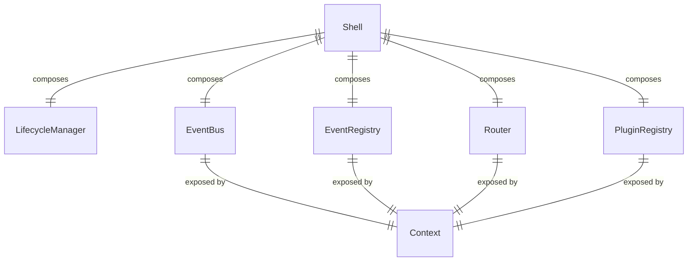
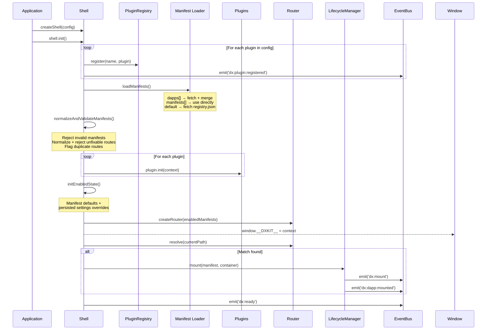
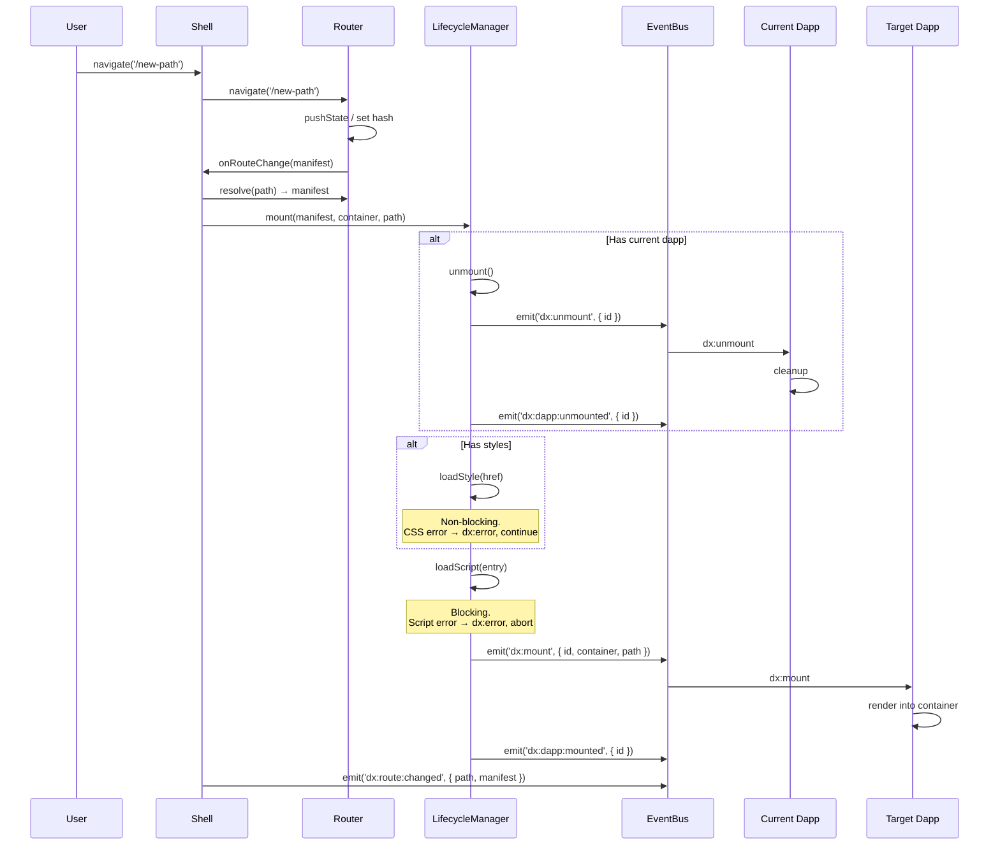

[Getting Started](getting-started.md) | [Dapp Development](dapp-development.md) | [Plugin Development](plugin-development.md) | **System Internals** | [Events Reference](events-reference.md) | [API Reference](api-reference.md) | [Cookbook](cookbook.md)

---

# System Internals

Deep technical reference for DxKit's architecture, subsystem design, and internal behavior.

[Architecture Overview](#architecture-overview) | [Init Sequence](#init-sequence) | [Navigation Sequence](#navigation-sequence) | [Router Internals](#router-internals) | [Lifecycle Manager Internals](#lifecycle-manager-internals) | [Event Bus Internals](#event-bus-internals) | [Event Registry Internals](#event-registry-internals) | [Plugin Registry Internals](#plugin-registry-internals) | [Manifest Loading Pipeline](#manifest-loading-pipeline) | [Optional Dapp State Machine](#optional-dapp-state-machine) | [Context Bridge](#context-bridge)

---

## Architecture Overview

The shell composes five subsystems. None depend on each other directly — the shell wires them together. The `Context` object is the public surface area exposed to dapps via `window.__DXKIT__`.



## Init Sequence



## Navigation Sequence



**Mount de-duplication.** The shell mounts each dapp once per activation. A route change to the *already-mounted* dapp doesn't re-mount — it emits `dx:route:subpath` if the sub-path changed, otherwise it's a no-op.

**Last-navigation-wins.** Because `mount()` is async (it awaits script/style/template loads), overlapping navigations need a supersession rule beyond same-dapp dedupe. The lifecycle manager captures a generation counter on every `mount()` call and re-checks it at each commit gate (post-style, post-template-fetch, post-sanitize, mid-dependency-loop, pre-entry-commit) — only the single most-recently-started mount can ever reach `dx:mount`, whether the superseding navigation targets the same dapp or a different one. On top of that, the shell tracks its own in-flight mount id as a narrower, same-dapp guard: a second route notification for the dapp already loading is dropped outright rather than racing it through the generation check.

## Router Internals

### Path Normalization

Every path goes through normalization before resolution:

1. Strip `basePath` prefix (if present)
2. Ensure leading `/`
3. Remove trailing `/` (except root `/`)

```text
basePath: '/app'
Input: '/app/dashboard/'  →  '/dashboard'
Input: 'dashboard'        →  '/dashboard'
Input: '/'                →  '/'
```

### Manifest Route Normalization

A second, different normalizer runs once per shell lifetime — when manifests are loaded, not on
every navigation. It trims surrounding whitespace, then applies the same leading/trailing-slash
rules as path normalization above. A route that's empty or whitespace-only after trimming is
unfixable: the manifest is discarded and a `shell:route` `dx:error` names it. This is a distinct
function from the router's per-navigation `normalizePath()` — it doesn't strip `basePath`, and it
runs once at load time rather than on every `resolve()` call.

### Longest Prefix Match

Routes are sorted by length (longest first), once at router construction — `resolve()` never
re-sorts on the navigation path. The first manifest where the normalized path equals the route or
starts with `route/` wins.

```text
Manifests: ['/tools/sender', '/tools', '/blog']

'/tools/sender'       → /tools/sender  (exact match)
'/tools/sender/step2' → /tools/sender  (prefix match)
'/tools/other'        → /tools         (prefix match)
'/blog/post/123'      → /blog          (prefix match)
'/about'              → null           (no match)
```

### Duplicate Routes

Two manifests declaring the same exact route both stay in the manifest list — nothing is
discarded at load time. The router's construction-time sort is stable, so `resolve()` always
returns whichever manifest was declared first in the original array, regardless of how the sorted
order lands. Manifest validation separately emits one `shell:manifest` `dx:error` naming both
colliding ids, so the collision is visible even though resolution already has a defined winner.

### History vs Hash Mode

| Aspect | History | Hash |
|--------|---------|------|
| URL format | `/app/dashboard` | `#/app/dashboard` |
| Read path | `window.location.pathname` | `window.location.hash.slice(1)` |
| Navigate | `history.pushState()` | `location.hash = '#...'` |
| Listeners | `popstate` | `popstate` + `hashchange` |
| Server requirement | Needs catch-all route | Works with any static server |

Hash mode is useful for static hosting, IPFS, and `file:///` environments where the server can't rewrite URLs.

**Notification semantics.** `navigate()` notifies route listeners exactly once per call. In hash mode, assigning a *new* `location.hash` fires an asynchronous `hashchange`, so `navigate()` lets that event drive the notification rather than notifying inline (doing both would double-notify and double-mount the target dapp). Assigning the *same* hash fires no `hashchange`, so `navigate()` notifies explicitly in that case. History mode always notifies explicitly — `pushState()` fires no `popstate`.

## Lifecycle Manager Internals

### Script Loading

The default script loader injects `<script type="module" src="...">` into `<head>`. A `Set` tracks loaded URLs — scripts load once and are never re-injected.

```text
First mount of dapp 'blog':
  1. Create <script type="module" src="/blog/dapp.js">
  2. Append to <head>
  3. Wait for onload
  4. Add '/blog/dapp.js' to loaded set

Second mount of dapp 'blog':
  1. '/blog/dapp.js' already in set → skip
  2. dx:mount fires immediately
```

Custom loaders can be passed via `ShellConfig.scriptLoader` for testing or custom bundler integration.

### Style Loading

Same pattern as scripts — `<link rel="stylesheet" href="...">` injected into `<head>`, tracked in a `Set`. Styles load once and persist across mounts.

**CSS is non-blocking:** a failed stylesheet emits `dx:error` but doesn't prevent the dapp from mounting. The dapp renders without its styles rather than not rendering at all.

### Requirement Checking

Before loading any script or style, the lifecycle manager checks `manifest.requires.plugins` against the plugin registry. Any missing plugin emits `dx:error` and aborts the mount entirely — no script load, no events.

```text
mount({ requires: { plugins: ['wallet', 'auth'] } })
  → registry.has('wallet') ✓
  → registry.has('auth') ✗
  → emit dx:error { source: 'lifecycle:my-dapp', error: 'Missing required plugin(s): auth' }
  → return (no mount)
```

### Template Loading & Container Clearing

A declared `template` is fetched and, if a `sanitizeTemplate` hook is configured, sanitized
before being written to the container. Both steps are pre-injection — a failure at either returns
before any `innerHTML` write happens, so there's nothing to clean up.

Dependency scripts and the entry script load *after* the template is already in the container, so
their failures are post-injection. Both explicitly clear the container (`container.innerHTML =
''`) before returning, so a failed mount never leaves a previous partial render addressable in the
DOM.

### Template Caching

Fetched templates are cached by URL, wrapping outermost above the load timeout — a cache hit
returns immediately and never touches `fetch` or its timer. Only successful fetches are cached;
failures and timeouts reject through uncached. The cache stores raw HTML: the sanitizer hook runs
fresh on every mount, including cache hits, never on cached-sanitized output. `clearTemplateCache()`
drops the whole cache; `invalidateTemplate(url)` drops one entry, keyed by the manifest-declared
template URL verbatim.

## Event Bus Internals

### CustomEvent Foundation

The event bus wraps `addEventListener`/`removeEventListener`/`dispatchEvent` on a target (defaults to `window`). Events are dispatched as `CustomEvent` with a typed `detail` payload.

```text
bus.emit('dx:ready', {})
  → new CustomEvent('dx:ready', { detail: {} })
  → target.dispatchEvent(event)
```

### Listener Object

`bus.on()` returns a `Listener` with pause/resume/off controls:

```js
const listener = bus.on('dx:ready', handler);
listener.paused;   // false
listener.pause();  // handler stops receiving events (subscription stays)
listener.resume(); // handler receives events again
listener.off();    // permanent removal
```

Internally, paused listeners remain subscribed to the EventTarget but silently drop events in the wrapper function.

### Handler Tracking

The bus maintains a `Map<handler, wrapper>` per event name. This allows `off()` to find the correct wrapper for `removeEventListener`, since the wrapper (which handles pausing) is different from the original handler.

## Event Registry Internals

### Namespace Validation

```text
dx:ready                     → REJECTED: built-in shell event
dx:custom:thing              → REJECTED: reserved dx: prefix (not dx:plugin:)
dx:plugin:wallet:connected   → OK if source === 'wallet'
dx:plugin:wallet:connected   → REJECTED if source !== 'wallet' (namespace mismatch)
dx:plugin:wallet             → REJECTED: invalid format (needs 4 segments)
myapp:loaded                 → OK (no dx: prefix — dapp/developer event)
```

### Conflict Resolution

- Same source re-registers same event → **no-op** (idempotent)
- Different source registers same event → **throws** (ownership conflict)
- Successful registration → `dx:event:registered` emitted with new event names

## Plugin Registry Internals

A `Map<string, Plugin>` with a defensive copy on `getAll()`:

```js
getAll()  → new object each call (mutations don't affect registry)
get(name) → direct reference to plugin instance (no copy)
```

## Manifest Loading Pipeline

Three-tier fallback with short-circuit:

```js
if (config.dapps?.length) {
  // Fetch each URL, deep-merge with overrides
  return Promise.all(dapps.map(fetchAndMerge))
}

if (config.manifests) {
  // Use inline manifests directly
  return config.manifests
}

// Default: fetch registry.json
return fetch(registryUrl).then(r => r.json())
```

### Deep Merge Rules

Used when `dapps[].overrides` are provided:

| Source type | Behavior |
|-------------|----------|
| Nested object | Recursive merge |
| Array | Replaced entirely (not concatenated) |
| Primitive | Replaced |
| `undefined` | Skipped (keeps original) |
| `null` | Replaces original |

```js
// Base manifest (fetched):
{ nav: { label: 'Blog', order: 1, hidden: false } }

// Override:
{ nav: { order: 5 } }

// Result:
{ nav: { label: 'Blog', order: 5, hidden: false } }
```

## Optional Dapp State Machine

```text
┌──────────────┐    enableDapp(id)   ┌─────────────┐
│   Disabled   │ ──────────────────→ │   Enabled   │
│              │ ←────────────────── │             │
└──────────────┘   disableDapp(id)   └─────────────┘
       │                                     │
       │                                     │
       ▼                                     ▼
  Excluded from:                       Included in:
  - getEnabledManifests()              - getEnabledManifests()
  - Router (no routing)                - Router (routable)
  - Settings sections hidden           - Settings sections visible
```

**On state change:**

1. `enabledState` map updated
2. Router destroyed and recreated with new enabled manifests
3. If the dapp whose route is currently active — mounted or still loading — was disabled, the
   mount is abandoned (or unmounted, if already committed) and the browser navigates to `/`
4. `dx:dapp:enabled` or `dx:dapp:disabled` emitted

**Initial state sources (priority order):**

1. Persisted settings (via settings plugin, if available)
2. Manifest defaults (`enabled` field, defaults to `true`)

The settings plugin synthesizes boolean toggles for optional dapps under the `_shell` section. Changes to these toggles call `enableDapp()`/`disableDapp()` on the shell, keeping everything in sync.

## Context Bridge

`window.__DXKIT__` is set during `shell.init()` and removed during `shell.destroy()`. It's a plain object wrapping shell internals:

```js
window.__DXKIT__ = {
  events,                    // EventBus instance
  eventRegistry,             // EventRegistry instance
  router: {
    navigate: (path) => router.navigate(path),
    getCurrentPath: () => router.getCurrentPath(),
  },
  getPlugin,                 // from PluginRegistry
  getPlugins,
  getManifests,
  getEnabledManifests,
  enableDapp,
  disableDapp,
  isDappEnabled,
  // Injected at runtime by plugins:
  settings: undefined,       // set by @dxkit/settings
};
```

The `router` property is a narrow wrapper — it doesn't expose `resolve()`, `onRouteChange()`, or `destroy()`. Dapps can navigate and read the path, but can't manipulate the router directly.

Plugins inject additional properties by mutating the context object during `init()`. This is a deliberate pattern — the `Context` type declares `settings?` as an optional field.
